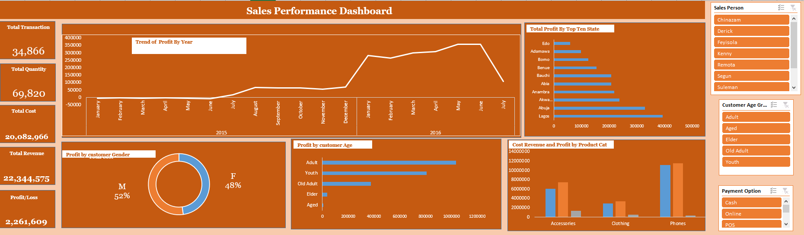
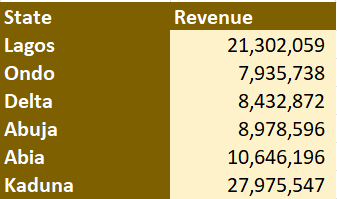
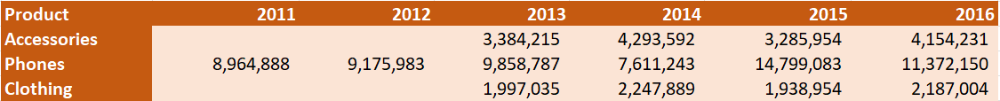
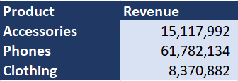

# Excel Dashboard Analysis

## Project Overview
This project presents an interactive Excel dashboard created for business intelligence, KPI monitoring, revenue analysis, and performance reporting. The dashboard transforms raw business data into meaningful insights using Excel data visualization and dashboarding techniques.

The aim of this project is to support data-driven decision-making by providing a clear overview of sales trends, revenue distribution, and product performance through interactive visuals and KPI tracking.

---

## Objectives
- Analyze business revenue performance
- Monitor KPI metrics and trends
- Visualize sales performance across products and states
- Create an interactive reporting dashboard
- Support business insight generation using Excel analytics tools

---

## Key Features
- Interactive Excel dashboard
- KPI tracking and monitoring
- Revenue analysis by state
- Product performance analysis
- Yearly sales trend visualization
- Pivot tables and pivot charts
- Slicers and filtering functionality
- Business performance reporting

---

## Tools & Techniques Used
- Microsoft Excel
- Pivot Tables
- Pivot Charts
- Data Cleaning
- Conditional Formatting
- Dashboard Design
- Data Visualization
- KPI Reporting

---

## Dashboard Visualizations

### Sales Performance Dashboard


### Revenue by State


### Product Sales by Year


### Product Revenue Summary


---

## Key Insights
- Kaduna recorded the highest revenue among the listed states.
- Phones generated the highest overall product revenue.
- Sales performance increased significantly between 2014 and 2016.
- Interactive filtering improves business performance monitoring and analysis.

---

## Repository Structure

```text
excel-dashboard-analysis/
│
├── Excel_Dashboard_Analysis.xlsx
├── README.md
└── images/
    ├── sales_performance_dashboard.png
    ├── revenue_by_state.png
    ├── product_sales_by_year.png
    └── product_revenue_summary.png

---

## Project File
The complete interactive Excel dashboard workbook is included in this repository:

- `Excel_Dashboard_Analysis.xlsx`

---

## Author
Momodu Sadiq Favour

Data Analyst | Data Scientist | Business Intelligence Enthusiast
